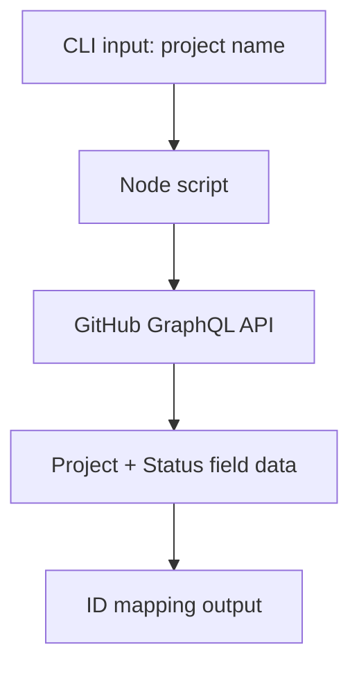
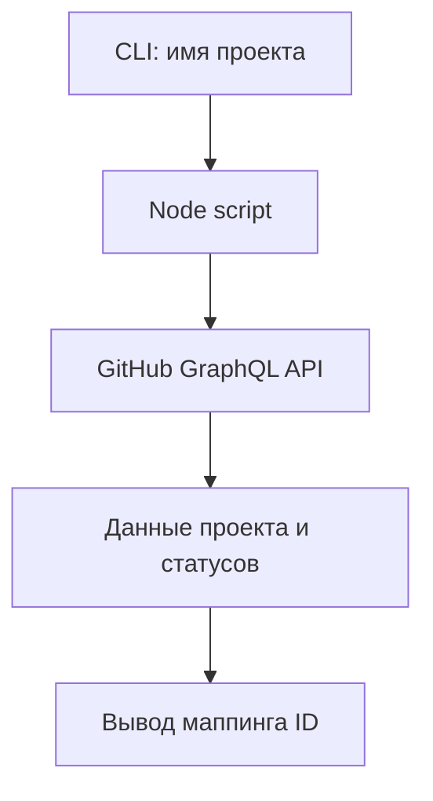

# github-project-fetcher

## English
## Problem
Teams using GitHub Projects V2 need quick, reproducible access to project status field IDs for automation scripts.
## Solution
This utility queries GitHub GraphQL API and prints project/status field identifiers for downstream automation.
## Tech Stack
- Node.js
- GitHub GraphQL API
- `node-fetch`
- `dotenv`
## Architecture
```text
fetchProjectId.js
package.json
```

## Features
- Fetch project by name
- Supports personal and organization scopes
- Resolves Status field and option IDs
- Outputs stable variable mapping for automation
## How to Run
```bash
npm install
cp .env.example .env
node ./fetchProjectId.js "Project Name"
```

## Русский
## Проблема
Командам с GitHub Projects V2 нужен быстрый и воспроизводимый способ получить ID полей статуса для автоматизации.
## Решение
Утилита обращается к GitHub GraphQL API и выводит идентификаторы проекта и статус-колонок для последующих скриптов.
## Стек
- Node.js
- GitHub GraphQL API
- `node-fetch`
- `dotenv`
## Архитектура
```text
fetchProjectId.js
package.json
```

## Возможности
- Поиск проекта по имени
- Поддержка user/org пространств
- Извлечение Status field и option IDs
- Вывод переменных для automation-скриптов
## Как запустить
```bash
npm install
cp .env.example .env
node ./fetchProjectId.js "Project Name"
```
